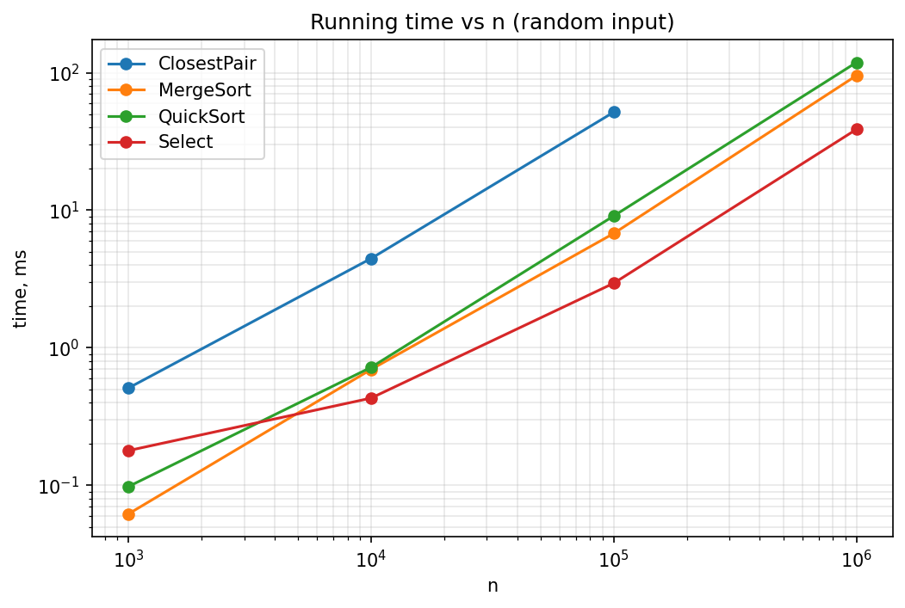
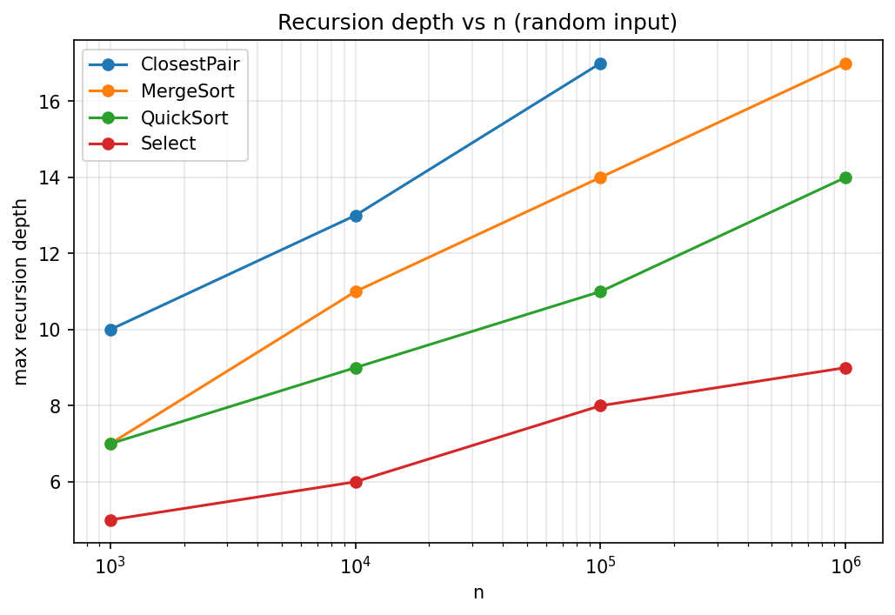
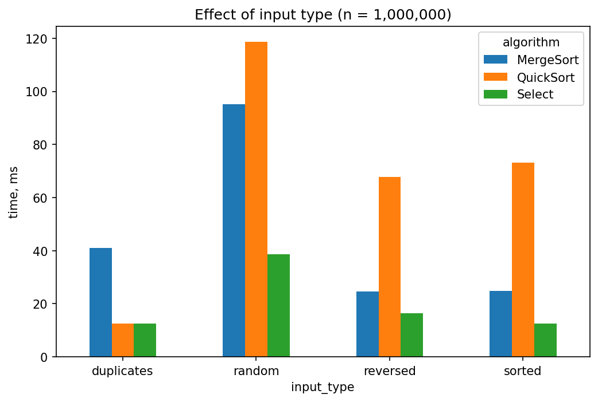
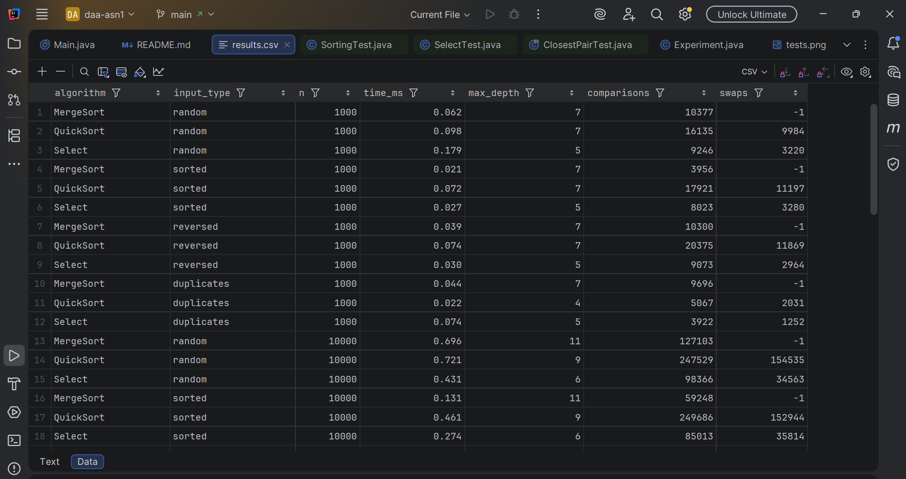
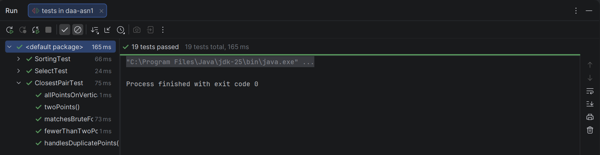

# Assignment 1

## A. Project Overview

The goal of this assignment is to implement classic divide-and-conquer algorithms in Java, analyze their running-time recurrences (Master Theorem / Akra–Bazzi intuition), measure them experimentally (time, recursion depth, comparisons) and compare theory with practice.

Implemented algorithms:

| Class | Algorithm | Complexity |
|---|---|---|
| `MergeSorter` | MergeSort (linear merge, reusable buffer, insertion-sort cutoff = 16) | Θ(n log n) |
| `QuickSorter` | Randomized QuickSort (3-way in-place partition, recurse into the smaller part, loop over the larger) | Θ(n log n) expected, O(n²) worst case |
| `DeterministicSelector` | Median-of-Medians Select (groups of 5, in-place partition) | Θ(n) worst case |
| `ClosestPairSolver` | Closest pair of points (sort by x, recursive split, strip check in y-order) | Θ(n log n) |

Other classes: `Point` (2D point), `Experiment` (benchmarks and CSV output), `Main` (entry point).

### How to run

```
mvn test                     # run JUnit tests (folder tests/)
java -cp target/classes Main # run experiments, writes results/results.csv
```

Or run `Main` / the tests directly from IntelliJ IDEA.

### Repository structure

```
src/         MergeSorter, QuickSorter, DeterministicSelector, ClosestPairSolver, Point, Experiment, Main
tests/       SortingTest, SelectTest, ClosestPairTest (JUnit 5)
results/     results.csv
docs/        plots/, screenshots/
```

---

## B. Algorithm Analysis

### 1. MergeSort

**How it works.** The array is split in half recursively. Pieces of at most 16 elements are sorted with insertion sort (cutoff), because it is faster than recursing down to single elements. Two sorted halves are merged in linear time. A single auxiliary buffer of size n is allocated once in `sort()` and reused by every merge, so there are no repeated allocations.

**Complexity.** Time Θ(n log n) in all cases. Extra space Θ(n) (the buffer) plus O(log n) stack.

**Recurrence.** T(n) = 2T(n/2) + Θ(n).
Master Theorem: a = 2, b = 2, f(n) = Θ(n) = Θ(n^(log₂2)), so Case 2 applies and T(n) = Θ(n log n).

### 2. QuickSort (randomized)

**How it works.** A random element is chosen as pivot. The range is partitioned in place into three parts: `< pivot`, `== pivot`, `> pivot` (Dutch national flag). The algorithm recurses into the **smaller** part and iterates (`while` loop) over the larger one. The three-way partition keeps duplicate-heavy input from degrading to O(n²).

**Complexity.** Expected Θ(n log n); worst case O(n²) (extremely unlikely with a random pivot). Extra space O(log n) for the stack, guaranteed by the smaller-first rule.

**Recurrence.** T(n) = T(k) + T(n − k − 1) + Θ(n), where k is the size of the left part.
With a random pivot the expected split is balanced enough that T(n) = Θ(n log n) (about 1.39·n·log₂n comparisons). In the balanced case it is exactly the MergeSort recurrence, Master Theorem Case 2. In the worst case (k = 0 always) T(n) = T(n−1) + Θ(n) = Θ(n²); this case is not covered by the Master Theorem (unequal subproblem sizes) and is solved by unrolling.

### 3. Deterministic Select (Median-of-Medians)

**How it works.**
1. Split the range into groups of 5 and sort each group with insertion sort.
2. Move each group's median to the front and **recursively** find the median of these medians: this is the pivot.
3. Partition the range around the pivot in place (three-way).
4. Continue only in the part that contains the k-th element (or return the pivot if k falls in the block of equal elements).

**Complexity.** Θ(n) worst case. Extra space O(log n) for the stack.

**Recurrence.** T(n) ≤ T(n/5) + T(7n/10) + Θ(n).
The two subproblem fractions sum to 1/5 + 7/10 = 9/10 < 1. By Akra–Bazzi, find p with (1/5)^p + (7/10)^p = 1; here p ≈ 0.84 < 1. The integral term dominates and T(n) = Θ(n). Intuitively, the work at each level is at most 9/10 of the previous level, so the total is a geometric series bounded by 10·cn.

### 4. Closest Pair of Points

**How it works.**
1. Sort points by x once.
2. Split at the middle, solve both halves recursively, and take d = the best distance found so far.
3. Merge the two halves by y (like MergeSort), so each call returns its range sorted by y.
4. Build the strip of points with |x − midX| < d and compare each point only with following points whose y-difference is less than d. A packing argument shows that only a constant number (at most 7) of neighbours must be checked per point.

Base case: 2–3 points are checked by brute force. Duplicate points are supported (distance 0).

**Complexity.** Θ(n log n) time, Θ(n) extra space.

**Recurrence.** T(n) = 2T(n/2) + Θ(n) (merge by y + strip scan). Master Theorem Case 2: T(n) = Θ(n log n).

---

## C. Experimental Results

**Setup.** Java (JDK 25 running code compiled for 17), `System.nanoTime()`. For each configuration: 3 warm-up runs (JIT), then 5 measured runs; the table shows the **median** time. Input types: random, sorted, reverse-sorted, duplicate-heavy (values 0–9). Select searches for the median (k = n/2). ClosestPair uses random points and n ≤ 100 000. Raw data: [`results/results.csv`](results/results.csv).

### Execution time (ms), random input

| n | MergeSort | QuickSort | Select | ClosestPair |
|---:|---:|---:|---:|---:|
| 1 000 | 0.062 | 0.098 | 0.179 | 0.510 |
| 10 000 | 0.696 | 0.721 | 0.431 | 4.458 |
| 100 000 | 6.781 | 9.089 | 2.948 | 51.629 |
| 1 000 000 | 95.224 | 118.644 | 38.704 | — |

### Execution time (ms) by input type, n = 1 000 000

| Input type | MergeSort | QuickSort | Select |
|---|---:|---:|---:|
| random | 95.224 | 118.644 | 38.704 |
| sorted | 24.833 | 73.103 | 12.471 |
| reversed | 24.544 | 67.738 | 16.503 |
| duplicates | 41.033 | 12.427 | 12.543 |

### Maximum recursion depth, random input

| n | MergeSort | QuickSort | Select | ClosestPair |
|---:|---:|---:|---:|---:|
| 1 000 | 7 | 7 | 5 | 10 |
| 10 000 | 11 | 9 | 6 | 13 |
| 100 000 | 14 | 11 | 8 | 17 |
| 1 000 000 | 17 | 14 | 9 | — |

### Comparisons, random input

| n | MergeSort | QuickSort | Select | ClosestPair (distance checks) |
|---:|---:|---:|---:|---:|
| 1 000 | 10 377 | 16 135 | 9 246 | 550 |
| 10 000 | 127 103 | 247 529 | 98 366 | 7 742 |
| 100 000 | 1 639 119 | 3 271 153 | 1 021 918 | 96 631 |
| 1 000 000 | 20 223 037 | 38 093 260 | 10 334 929 | — |

The full table (all input types, swaps) is in `results/results.csv`.

### Plots

**Time vs n** (log-log, random input)



**Recursion depth vs n** (random input)



**Effect of input type** (n = 1 000 000)



---

## D. Discussion

**Do the results match the theoretical complexity?**
Yes. On the log-log plot the MergeSort, QuickSort and ClosestPair lines are almost straight with nearly the same slope, as expected for Θ(n log n) (a factor of 10 in n gives a factor of about 11–14 in time). MergeSort goes from 6.8 ms (n = 100 000) to 95 ms (n = 1 000 000), a factor of 14. Select grows more slowly: 2.9 ms to 38.7 ms, a factor of about 13 including cache effects, consistent with Θ(n). ClosestPair grows about 10× per decade of n (0.51 → 4.46 → 51.6 ms). Recursion depth grows by roughly 3–4 levels per decade of n (7 → 11 → 14 → 17 for MergeSort), i.e. logarithmically.

**How does input structure affect performance?**
MergeSort does the same amount of splitting on every input, but it is 4× faster on sorted and reversed data (25 ms vs 95 ms at n = 10⁶): the comparison count drops (about 9·10⁶ vs 20·10⁶ on sorted data) and memory access and branches become very predictable. QuickSort is much less sensitive to order than a fixed-pivot version would be: the random pivot keeps the depth at 14–15 even for sorted and reversed input, and there is no O(n²) blow-up. Duplicate-heavy input is the fastest case for QuickSort (12 ms, depth 4) thanks to the three-way partition, which removes all equal elements in one pass.

**Why does smaller-first recursion help QuickSort?**
Recursing into the smaller part and looping over the larger one guarantees that each recursive call handles at most half of the current range, so the stack depth is at most log₂ n even when the pivot is chosen badly. Without it, an unlucky sequence of pivots could produce depth Θ(n) and a stack overflow. The measured depths (14–15 at n = 10⁶, log₂10⁶ ≈ 20) confirm the bound.

**Why does Median-of-Medians guarantee O(n)?**
The median of the group medians is greater than or equal to about 3/10 of the elements and less than or equal to about 3/10 of the elements: half of the ⌈n/5⌉ groups have a median below it, and each of these groups contributes 3 elements. So after partitioning, the part we continue in has at most about 7n/10 elements. Finding the pivot costs T(n/5) and partitioning costs Θ(n), giving T(n) ≤ T(n/5) + T(7n/10) + cn. Since 1/5 + 7/10 < 1, the work shrinks geometrically from level to level and the total is Θ(n). The experiments show a linear trend (about 10 comparisons per element), though with a larger constant than a randomized selection would have.

**Why is divide-and-conquer Closest Pair faster than O(n²) for large inputs?**
Brute force checks all n(n−1)/2 pairs. The divide-and-conquer version only compares points within the strip, and each point has a constant number of candidates in the strip, so each level of recursion does Θ(n) work over log n levels. The measured number of distance checks illustrates this: for n = 100 000 the algorithm made 96 631 checks, while brute force would need about 5·10⁹. For small n (a few hundred points) brute force is competitive because of the recursion and merging overhead, but the gap grows quickly.

**What practical factors affect performance?**
- **JVM/JIT:** the first runs are interpreted or lightly compiled and are much slower. This is why each configuration has 3 warm-up runs and the median of 5 measured runs is reported. Absolute times of the small inputs (n = 1000, tens of microseconds) are noisy.
- **Cache and memory access:** sequential access patterns (sorted input for MergeSort, merging, partitioning) are much faster than random access, which explains the 4× gap for MergeSort on sorted vs random data.
- **Branch prediction:** predictable comparisons (sorted or duplicate-heavy data) are cheaper.
- **Garbage collection and allocation:** MergeSort reuses one buffer, avoiding repeated allocation. ClosestPair works with `Point` objects (pointer chasing, poor locality), which is one reason it is slower than the array sorts in absolute terms even though all are Θ(n log n).
- **Constants and counting:** QuickSort is asymptotically as good as MergeSort, but here it made almost twice as many counted comparisons (38 M vs 20 M at n = 10⁶). Part of this is the counting method (the three-way partition counts up to two comparisons per element), and part is the higher constant (about 1.39·n·log₂n vs about n·log₂n). Select is faster than a full sort, but it solves an easier problem (one order statistic), so the two are not directly comparable.

---

## E. Reflection

Through this assignment I discovered that one recurrence, T(n) = 2T(n/2) + Θ(n), describes three quite different algorithms: Merge Sort, Quicksort with balanced partitions, and Closest Pair of Points. I also saw how the Master Theorem, together with the basic idea behind the Akra–Bazzi method, makes analyzing such recurrences much faster and clearer.

The hardest parts of the implementation were the three-way partition in Quicksort, the median-of-medians selection algorithm, and the closest pair algorithm. A separate part of the work was collecting the measurements, saving them to a CSV file and turning them into graphs and tables for the report.

---

## F. Screenshots

**Program output**



**Test results (19 tests, all passed)**



**Plots**

See section C: `docs/plots/time_vs_n.png`, `docs/plots/depth_vs_n.png`, `docs/plots/input_types.png`.